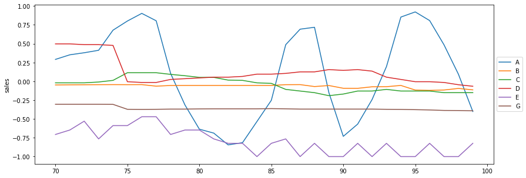
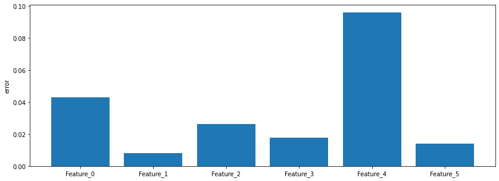

# Multivariate Time Series Forecasting using GNNs

Graph Neural Networks (GNNs) have emerged as powerful tools for multivariate time series forecasting, particularly in scenarios where the variables exhibit complex interdependencies. By representing the relationships between variables as a graph structure, GNNs excel at capturing intricate patterns and correlations within the data. In the context of multivariate time series forecasting, GNNs can leverage these relationships to learn rich representations of the underlying dynamics, enabling accurate predictions of future values for multiple variables simultaneously. Unlike traditional methods that may struggle to model non-linear or higher-order dependencies, GNNs offer a flexible framework for capturing such complexities, making them well-suited for real-world applications where variables exhibit intricate interconnections. Moreover, GNNs can adaptively learn from the graph structure, allowing them to handle varying degrees of correlation and topology across different datasets. Overall, the use of GNNs in multivariate time series forecasting holds great promise for improving prediction accuracy and capturing the nuanced interactions present in complex systems.

  
 

In our project, we devised a Graph Neural Network (GNN) tailored specifically for forecasting six distinct variables within a multivariate time series context. By structuring the relationships between these variables into a graph representation, our model adeptly captures the intricate interdependencies inherent in the data. Leveraging the capabilities of GNNs, our model learns dynamic and nuanced representations of the underlying patterns and correlations, enabling precise predictions for each of the six variables simultaneously. This approach surpasses traditional forecasting methods by seamlessly accommodating nonlinear relationships and higher-order dependencies, which are often prevalent in real-world datasets. Furthermore, our GNN model demonstrates adaptability to varying degrees of correlation and topology across different datasets, enhancing its versatility and applicability across diverse domains. Overall, our project showcases the effectiveness of GNNs in multivariate time series forecasting, offering a promising avenue for accurate prediction and insightful analysis of complex systems.

## Prerequisites
  * Linux or macOS 
  * Python 3 
  * scipy
  * matplotlib
  * sklearn
  * tensorflow
  * spektral

## Setup
The code can be run with Python 3.6 and above.

Clone this repo:

    git clone https://github.com/slitiWassim/Multivariate-Time-Series-Forecasting-using-GNNs.git
    cd Multivariate-Time-Series-Forecasting-using-GNNs/

Install the required packages:

    pip install -r requirements.txt    

## Evaluation

 

## Contact
For any question, please file an [issue](https://github.com/slitiWassim/Multivariate-Time-Series-Forecasting-using-GNNs/issues) or contact:

    wassim.sliti@ept.ucar.tn

